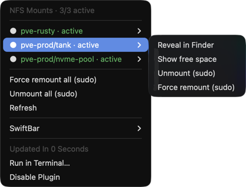

# nfs-swiftbar

[](https://github.com/ggfevans/nfs-swiftbar/actions/workflows/lint.yml)
[](LICENSE)


A [SwiftBar](https://github.com/swiftbar/SwiftBar) plugin that shows the status of
NFS shares mounted by macOS autofs, with sudo actions to recover a stale mount.

<p align="center">
  
</p>

## Why

Under autofs, shares mount on access and unmount after an idle period, so nothing
tells you what is currently mounted or whether a server is up. This plugin shows
that in the menu bar. Its background poll never reads the mount paths, so it does
not keep idle shares alive.

## Status

Shares are read from `/etc/auto_direct`. Each one renders as:

| Dot | State | Meaning |
|-----|-------|---------|
| 🟢 | active | mounted now |
| ⚪️ | idle | reachable but not mounted (normal after the idle timeout) |
| 🔴 | unreachable | nfsd (TCP 2049) not answering |

The menu-bar icon is green if any share is active, red if any host is
unreachable, otherwise grey. The header shows `N/total active`.

## Actions

Per share (sudo actions use a single admin prompt):

| Action | Effect |
|--------|--------|
| Reveal in Finder | opens the path, which mounts it |
| Show free space | reports `df` output (active shares only) |
| Unmount (sudo) | `umount -f`, no remount (active shares only) |
| Force remount (sudo) | `umount -f`, then re-access to mount fresh |

Root menu:

| Action | Effect |
|--------|--------|
| Force remount all (sudo) | remount every share in one prompt |
| Unmount all (sudo) | unmount every share in one prompt |

## Requirements

- macOS with [SwiftBar](https://github.com/swiftbar/SwiftBar).
- NFS shares in an autofs direct map at `/etc/auto_direct` (see Configuration).
- Stock tools: `bash`, `mount`, `nc`, `df`, `osascript`, `perl`.

## Configuration

The plugin parses `/etc/auto_direct`. Each line is `mountpoint  options  host:export`:

```
/Volumes/media      -fstype=nfs,resvport,rw,soft,intr,tcp   nas.example.lan:/export/media
/Volumes/backups    -fstype=nfs,resvport,rw,soft,intr,tcp   nas.example.lan:/export/backups
```

Wire it into the automounter in `/etc/auto_master`:

```
/-    auto_direct
```

Then run `sudo automount -vc`. To use a different map file, edit the `MAP`
variable at the top of `nfs.30s.sh`.

## Install

```bash
git clone https://github.com/ggfevans/nfs-swiftbar.git
ln -sf "$PWD/nfs-swiftbar/nfs.30s.sh" "$HOME/Documents/SwiftBar/nfs.30s.sh"
```

Confirm your SwiftBar plugin directory with
`defaults read com.ameba.SwiftBar PluginDirectory`, then run SwiftBar > Refresh
All. The `30s` in the filename sets the refresh interval; rename it (e.g.
`nfs.1m.sh`) to change it.

## Idle behaviour

The poll reads the `mount` table and probes TCP 2049. It never runs `ls`, `stat`
or `df` on a mount path, since that would re-trigger the automounter on every
cycle. `df` (Show free space) and path access (Reveal in Finder) run only on a
click. Unmount and remount use `umount -f` so an unreachable server cannot hang
them, and the re-access is bounded by a `perl` alarm.

## Development

```bash
./nfs.30s.sh --selftest
```

Renders all three states from fixture data without touching real mounts. The
live poll and `--selftest` share one function (`emit_share`), so the output
matches.

## License

[MIT](LICENSE)
